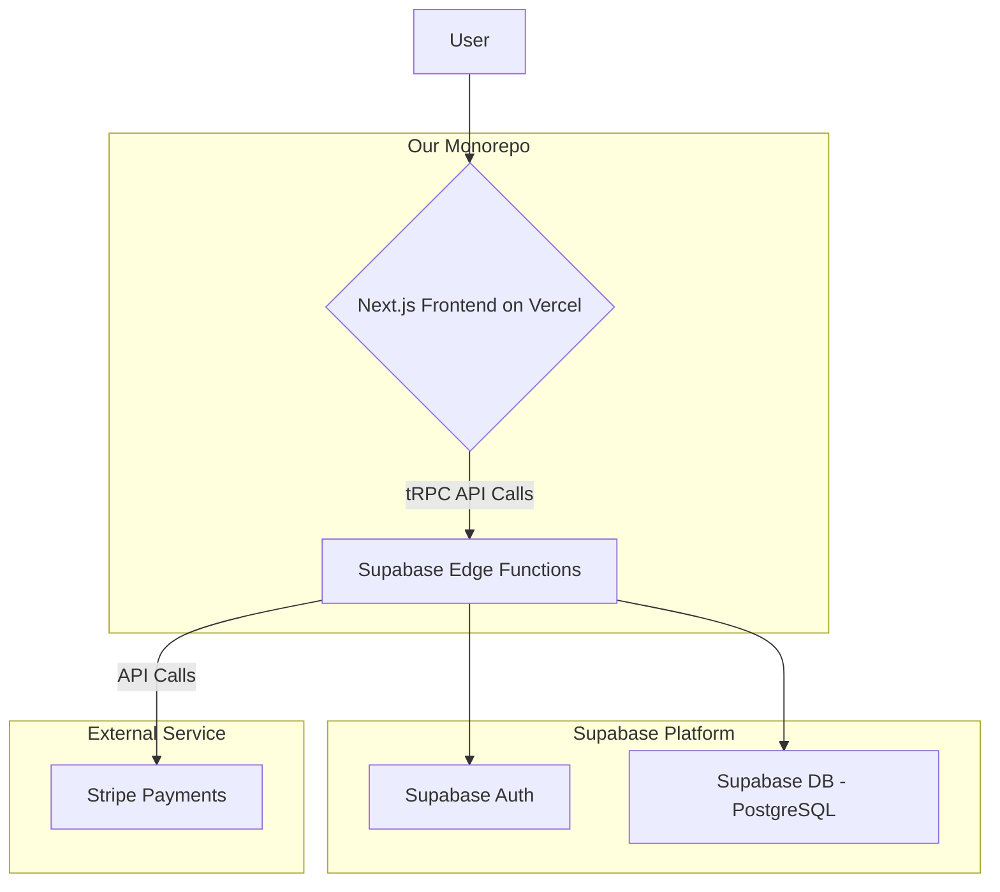

# Cleanly: Fullstack Architecture Document

---

## Introduction

This document outlines the complete fullstack architecture for Cleanly, including backend systems, frontend implementation, and their integration. It serves as the single source of truth for AI-driven development, ensuring consistency across the entire technology stack.

### Starter Template or Existing Project

The project will be built using a **T3-style starter template** as its foundation. This choice accelerates setup by providing pre-configured best practices for a typesafe, full-stack application using Next.js, TypeScript, tRPC, Prisma, and Tailwind CSS.

---

## High Level Architecture

### Technical Summary

This document outlines a full-stack, serverless architecture for the "Cleanly" web application. The system will be built within a monorepo, utilizing a Next.js frontend for the user interface and Supabase for the backend, including a PostgreSQL database, authentication, and serverless Edge Functions for business logic. This approach prioritizes a secure, scalable foundation and a fast developer experience, aligning with our MVP goals of launching a reliable platform efficiently.

### High Level Overview

The architecture is based on the technical decisions made in the PRD. The **Monorepo** structure will house the Next.js frontend and the Supabase Edge Functions, allowing for shared types and easy integration via tRPC. The primary architectural style is **Serverless**, leveraging Supabase's managed infrastructure to handle business logic, database interactions, and user authentication. This minimizes DevOps overhead and allows for automatic scaling.

### High Level Project Diagram



---

## Tech Stack

| Category             | Technology              | Version |
| -------------------- | ----------------------- | ------- |
| Frontend Framework   | Next.js                 | ~14.2   |
| UI Component Library | Shadcn/ui               | latest  |
| Backend Framework    | Supabase Edge Functions | latest  |
| API Style            | tRPC                    | ~11.0   |
| Database ORM         | Prisma                  | ~5.12   |
| Authentication       | Supabase Auth           | latest  |
| Build Tool           | Turborepo               | latest  |
| Styling              | Tailwind CSS            | ~3.4    |

---

## Data Models

### User (Authentication)

**Purpose:** Purely for authentication via Supabase Auth.

### Profile

**Purpose:** Stores public-facing data and role information for a User.

### Business

**Purpose:** Stores the profile information for a service provider.

### Service

**Purpose:** Stores a distinct service offered by a Business.

### Booking

**Purpose:** Represents a transaction for a specific Service.

---

## Data Policies

**Timestamps:** All timestamp fields must be stored in the database in UTC.

---

## API Specification (tRPC Routers)

### Core Principle: Authorization

All protected procedures that access or modify specific data must include authorization logic to verify that the logged-in user is the owner of or has explicit permission to access that data.

### Routers

The API will be organized into logical routers such as `profileRouter`, `businessRouter`, and `bookingRouter`.

---

## Core Workflows

### Booking Flow (Authorize & Capture Model)

The primary booking flow uses an "Authorize and Capture" model. A hold is placed on the customer's card at the time of request. The funds are only captured after the business partner accepts the booking.

---

## Database Schema

The database schema is defined with SQL CREATE TABLE statements for profiles, businesses, services, and bookings, including foreign key relationships, constraints, and data types (e.g., uuid, timestamptz). It also defines ENUM types for roles and statuses to ensure data integrity.

---

## Source Tree

The project will be organized as a Turborepo monorepo.

```
/cleanly-app
├── apps
│   ├── web/                    # The Next.js frontend application
│   └── supabase/               # The Supabase backend project
│       ├── functions/          # Supabase Edge Functions
│       ├── migrations/         # SQL migration files generated by Prisma
│       └── config.toml         # Core Supabase project configuration
│
├── packages
│   ├── db/                     # Prisma schema and generated client
│   ├── types/                  # Shared TypeScript interfaces
│   └── ui/                     # Shared UI components
│
├── package.json
└── turbo.json
```

**Developer Workflow Note:** The database schema is defined in `packages/db/prisma/schema.prisma`. Developers will use Prisma to generate SQL migration files, which are placed in `apps/supabase/migrations/` to be deployed by the Supabase CLI.

---

## Infrastructure and Deployment

### Deployment Strategy

Deployment will use a Git-based CI/CD strategy, leveraging Vercel for the frontend and Supabase's GitHub Action for the backend. Preview environments will be created for all pull requests, with the main branch deploying to production. Vercel's one-click rollback feature will be our primary rollback method.

### Environments

- **Development:** A developer's local machine.
- **Preview:** Automatically created by Vercel for every pull request.
- **Production:** The live application, hosted on Vercel and Supabase.

### Error Handling Strategy

The system will use provider-native logging (Vercel/Supabase) with a Correlation ID for tracing. The frontend uses React Error Boundaries, while the backend uses a central error handler to provide safe, user-friendly error messages.

---

## Coding Standards

### Core Standards

- **Style:** The project will use ESLint and Prettier.
- **Automated Enforcement:** A pre-commit hook (using husky) will be configured to automatically run the linter and formatter.

### Critical Rules

- **Type Sharing:** Always define shared data types in the `packages/types` directory.
- **API Layer:** All frontend data access must go through the defined tRPC procedures.
- **Database Access:** All database access within Edge Functions must use the Prisma client.
- **Environment Variables:** All environment variables must be validated at build time.
- **Security:** Never log sensitive user information or secret API keys.
