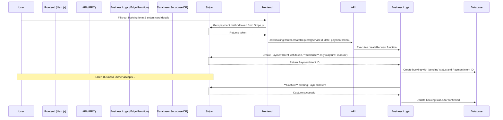

# Cleanly: Technical Architecture Details

## Tech Stack

### Technology Stack Table

| Category                 | Technology                     | Version | Purpose                                 | Rationale                                                               |
| :----------------------- | :----------------------------- | :------ | :-------------------------------------- | :---------------------------------------------------------------------- |
| **Frontend Language**    | TypeScript                     | ~5.4    | Primary development language            | Strong typing for bug prevention and better developer experience.       |
| **Frontend Framework**   | Next.js                        | ~14.2   | Full-stack React framework              | Fast performance, great developer experience, serverless support.       |
| **UI Component Library** | Shadcn/ui                      | latest  | Composable and accessible UI components | Works perfectly with Tailwind, is unstyled by default for full control. |
| **State Management**     | Zustand                        | ~4.5    | Lightweight state management            | Simple, effective, and less boilerplate than Redux for MVP scope.       |
| **Backend Language**     | TypeScript                     | ~5.4    | Language for Edge Functions             | Consistent language across the stack, ensures type safety.              |
| **Backend Framework**    | Supabase Edge Functions        | latest  | Serverless backend logic                | Managed, scalable, and integrates directly with our database.           |
| **API Style**            | tRPC                           | ~11.0   | Typesafe API layer                      | End-to-end type safety between frontend and backend.                    |
| **Database**             | PostgreSQL (via Supabase)      | 15.1    | Primary relational database             | Powerful, reliable, and expertly managed by Supabase.                   |
| **Database ORM**         | Prisma                         | ~5.12   | Database toolkit                        | Simplifies database interactions and provides type safety.              |
| **File Storage**         | Supabase Storage               | latest  | For user/business uploads (e.g., logos) | Simple S3-compatible storage integrated with our backend.               |
| **Authentication**       | Supabase Auth                  | latest  | User and session management             | Secure, integrated with the database, provides row-level security.      |
| **Frontend Testing**     | Vitest & React Testing Library | latest  | Component and unit testing              | Modern, fast, and the standard for testing React components.            |
| **Backend Testing**      | Vitest                         | latest  | Unit testing for Edge Functions         | Consistent testing framework across the stack.                          |
| **Build Tool**           | Turborepo                      | latest  | Monorepo management tool                | High-performance build system for managing the monorepo.                |
| **Styling**              | Tailwind CSS                   | ~3.4    | Utility-first CSS framework             | Rapid UI development and easy customization.                            |

---

## Data Models

### User (Authentication)

- **Purpose**: Purely for authentication via Supabase Auth.
- **TypeScript Interface**:
  ```typescript
  interface User {
    id: string;
    email: string;
  }
  ```

### Profile

- **Purpose**: Stores public-facing data and role information for a `User`.
- **TypeScript Interface**:
  ```typescript
  interface Profile {
    id: string;
    fullName: string;
    role: 'customer' | 'business_owner';
  }
  ```

### Business

- **Purpose**: Stores the profile information for a service provider.
- **TypeScript Interface**:
  ```typescript
  interface Business {
    id: string;
    ownerId: string;
    businessName: string;
    bio: string;
    serviceCategory:
      | 'cleaning'
      | 'plumbing'
      | 'electrical'
      | 'decoration'
      | 'pest_control'
      | 'car_detailing';
  }
  ```

### Service

- **Purpose**: Stores a distinct service offered by a `Business`.
- **TypeScript Interface**:
  ```typescript
  interface Service {
    id: string;
    businessId: string;
    name: string;
    description: string;
    price: number;
  }
  ```

### Booking

- **Purpose**: Represents a transaction for a specific `Service`.
- **TypeScript Interface**:
  ```typescript
  interface Booking {
    id: string;
    customerId: string;
    businessId: string;
    serviceId: string;
    bookingDate: Date;
    totalCost: number;
    status: 'pending' | 'confirmed' | 'declined' | 'cancelled' | 'completed';
    createdAt: Date;
  }
  ```

### Data Policies

- **Timestamps**: All `timestamp` fields must be stored in the database in **UTC**.

---

## API Specification (tRPC Routers)

### Core Principle: Authorization

All protected procedures that access or modify specific data **must** include authorization logic to verify that the logged-in user is the owner of or has explicit permission to access that data.

### Routers

The API will be organized into logical routers such as `profileRouter`, `businessRouter`, and `bookingRouter`. Public procedures will be used for public data, while protected procedures will enforce the Authorization Principle.

---

## Core Workflows

### Booking Flow (Authorize & Capture Model)

The primary booking flow uses an **"Authorize and Capture"** model. A hold is placed on the customer's card at the time of request. The funds are only captured after the business partner accepts the booking.


