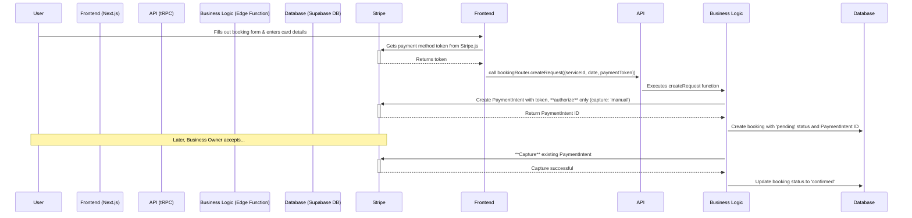

# Core Workflows

## Booking Flow (Authorize & Capture Model)

The primary booking flow uses an **"Authorize and Capture"** model. A hold is placed on the customer's card at the time of request. The funds are only captured after the business partner accepts the booking.

