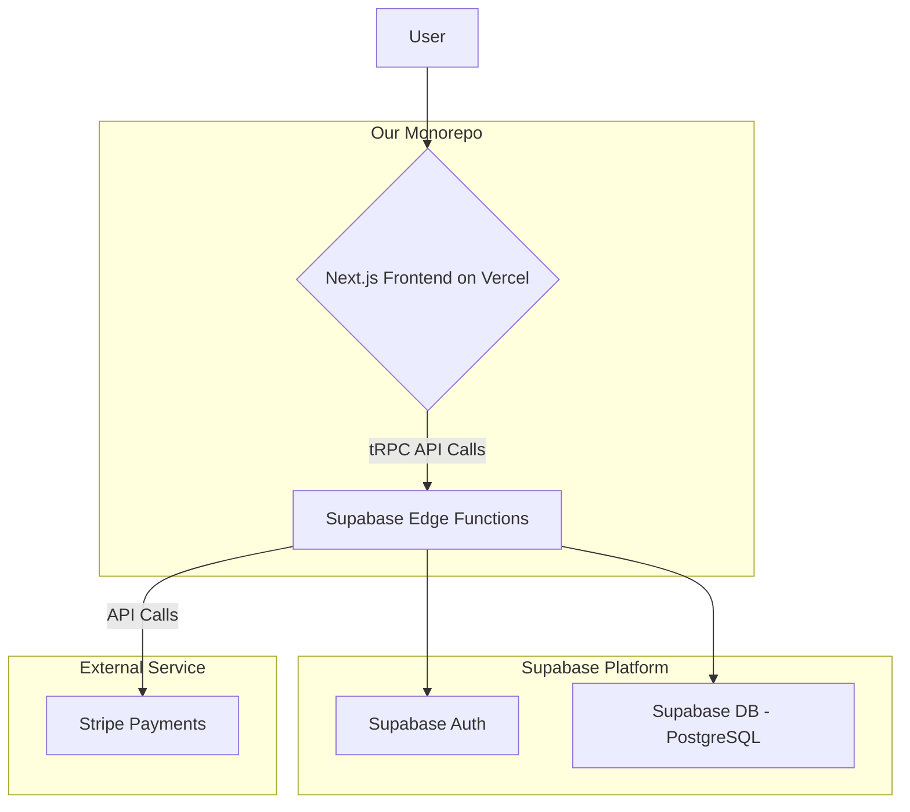

# High Level Architecture

## Technical Summary

This document outlines a full-stack, serverless architecture for the "Cleanly" web application. The system will be built within a monorepo, utilizing a Next.js frontend for the user interface and Supabase for the backend, including a PostgreSQL database, authentication, and serverless Edge Functions for business logic. This approach prioritizes a secure, scalable foundation and a fast developer experience, aligning with our MVP goals of launching a reliable platform efficiently.

## High Level Overview

The architecture is based on the technical decisions made in the PRD. The **Monorepo** structure will house the Next.js frontend and the Supabase Edge Functions, allowing for shared types and easy integration via tRPC. The primary architectural style is **Serverless**, leveraging Supabase's managed infrastructure to handle business logic, database interactions, and user authentication. This minimizes DevOps overhead and allows for automatic scaling.

## High Level Project Diagram

